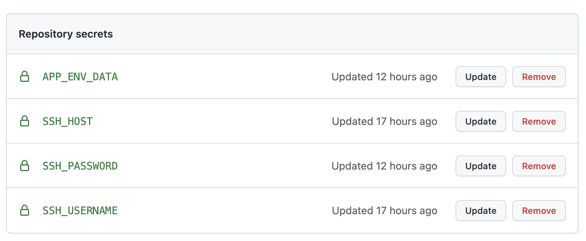

# laravel-deploy-action
Automatically deploy your Laravel app to remote server

### Step one
Copy the `deploy.php` file to your application root path
### Step two
You need to create four environments that we need to connect the remote server, then create your workflow like below

### Write your workflow
Below is a simple workflow, you can customize it but the environment in `with` parameter is required
```yaml
name: Deoloy
on: [push]

jobs:
  deploy:
    runs-on: ubuntu-latest
    name: A Laravel deploy action example
    steps:
      - name: test
        uses: yankewei/laravel-deploy-action@main
        with:
          host: ${{ secrets.SSH_HOST }}
          username: ${{ secrets.SSH_USERNAME }}
          password: ${{ secrets.SSH_PASSWORD }}
          app_env_data: ${{ secrets.APP_ENV_DATA }}
```

Below is the required environment description
```yaml
  host: 
    description: 'The remote server ip, support IPV4 only'
    required: true
  username:
    description: 'The ssh login user name'
    required: true
  password:
    description: 'The ssh login password'
    required: true
  app_env_data:
    description: 'The environment variable for application, will be written into .env file'
    required: true
```